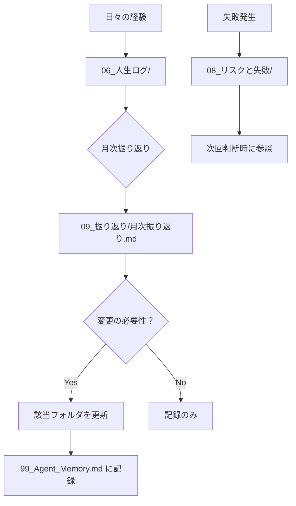

# Personal OS Template

> [!IMPORTANT]
> **このリポジトリに含まれるデータ（目標、価値観、自分史など）は、サンプルとして作成された架空の人物「田中 太郎」のものです。**
> 実際に使用する際は、これらのファイルを自分のデータで上書きしてください。
>
> **【サンプル設定：新・田中 太郎 (29)】**
> * **職業:** D2Cブランドのマーケティングマネージャー
> * **価値観:** 「ワクワクするか」「美意識があるか」で判断する感覚派
> * **趣味:** 古着、コーヒー、ソロキャンプ
> * **目標:** 自分のアパレルブランドを立ち上げる

> **このフォルダの目的**  
> AIが「あなたなら、どう考え、どう判断するか」を再現するための人格OS。  
> 単なるメモではなく、**意思決定の自動化と人格の外部化**を目指す。

---

## 📖 このOSの使い方

### AIとして読む時
1. **まず `01_コア・原則/` を読む** - 最上位の判断基準
2. **迷ったら `優先順位ルール.md` を参照**
3. **トレードオフは `02_価値観/` で重み付け**
4. **過去の判断は `08_リスクと失敗/` で検証**

### 人間として更新する時
1. **Coreは滅多に変えない** - 変更は `09_振り返り/` 経由で検討
2. **日々の記録は `06_人生ログ/` へ**
3. **新しい経験・失敗は即座に記録**
4. **月次・年次で `09_振り返り/` を実施**

---

## 🤖 ChatGPT で Personal OS を自動更新

会話の履歴から、Personal OS に入れるべき情報を **自動抽出** できます。

### 🚀 3ステップで完了

```
1️⃣ ChatGPT にプロンプトを貼り付け + あなたの会話を追加
   ↓
2️⃣ ChatGPT が JSON データを出力
   ↓
3️⃣ Claude Code でインポート → Personal OS に自動追記
```

### 📦 用意しているもの

| 内容 | 説明 |
|------|------|
| **Master Prompt** | 全 12 カテゴリを一度に分析 |
| **Category Prompts** | 特定カテゴリを深掘り分析（12 個） |
| **Documentation** | 詳細ガイド・トラブルシューティング |
| **Examples** | サンプル会話・抽出結果 |

### 📚 プロンプト集を見る

👉 **[prompts/ フォルダ](./prompts)** に全ファイルがあります

**はじめての方:** [prompts/README.md](./prompts/README.md) から開始してください（5 分で理解できます）

### 効果

- ✅ 同じ会話を何度も手で入力する必要がない
- ✅ 見落とした情報を自動検出
- ✅ データは常に Personal OS に蓄積
- ✅ GitHub で全履歴を追跡可能

---

## 🧭 判断に迷った時の原則（例）

### 最優先事項（Priority Order）
1. **自分がやりたくないか？** → NOなら、以下を検討しない
2. 長期的に選択肢が増えるか？
3. 他の人格（法人）に転用可能か？
4. 今やらないと不可逆な機会か？
5. 単純に金になるか？

### 絶対にやらないこと（Non-Negotiable）
- 自分が納得していない理屈で人を動かすこと
- 短期利益のために信頼を削ること
- 再現性のない精神論で進めること
- 「忙しさ」を努力として扱うこと

---

## 📁 フォルダ構成と役割

| フォルダ | 役割 | 更新頻度 |
|---------|------|---------|
| `01_コア・原則/` | 不変の中核（倫理・美学・信念） | ほぼ変更しない |
| `02_価値観/` | 価値観・トレードオフの重み付け | 年に数回 |
| `03_目標/` | 時間軸別の目標 | 月次・年次更新 |
| `04_判断ロジック/` | 判断フレームワーク | 半年ごと |
| `05_制約条件/` | 現実的制約 | 状況変化時 |
| `06_人生ログ/` | 事実の記録 | 日次・週次 |
| `07_スキル・資産/` | 使える武器 | 四半期ごと |
| `08_リスクと失敗/` | 失敗知識 | 失敗発生時 |
| `09_振り返り/` | 内省・更新検討 | 月次・年次 |
| `10_自分史/` | 個人の履歴 | 大きな変化時 |
| `11_性格プロファイル/` | 性格特性 | 年次 |
| `12_影響を受けたもの/` | 影響源の記録 | 半年ごと |

---

## 🎯 このOSが解決する問題

### Before（このOSがない状態）
- ❌ 同じ失敗を繰り返す
- ❌ 判断基準がブレる
- ❌ 「なんとなく」で決めて後悔
- ❌ 過去の経験が活かされない
- ❌ 人に説明できない

### After（このOSがある状態）
- ✅ 過去の失敗が蓄積され、回避できる
- ✅ 判断基準が明文化され、一貫性が保てる
- ✅ トレードオフを定量的に評価できる
- ✅ AIが自分の判断を代行・提案できる
- ✅ 自分の思考を他人に委譲できる

---

## 🔄 更新の流れ



---

## ⚠️ 注意事項

### Core を変更する前に
- 本当に「変わらない中核」が変わったのか？
- 単なる状況適応ではないか？
- `09_振り返り/` で十分検討したか？

### 感情と事実の分離
- `06_人生ログ/` = 事実のみ
- `09_振り返り/` = 感情・解釈を含む振り返り

---

## 📊 今後埋めるべき項目（例）

以下は今後 `09_振り返り` で埋めるべき項目：

- 宗教的・哲学的な最終世界観
- 家族に対する最終的な責任定義
- 「どこまで一人でやりたいか」の上限
- 理想的な死に方・人生の終わり方
